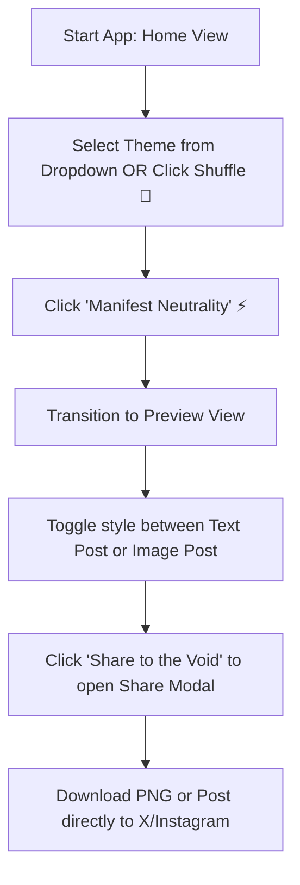

# Fence Sitter: Concept & Idea
**Tagline**: *Performative Apathy Generator*

**Fence Sitter** is a satirical toy app that lets users generate high-fidelity, non-committal, and performatively apathetic social media statements on controversial or mundane topics. 

It highlights the humorous side of trying to say absolutely nothing of substance while attempting to sound profound, balanced, and deeply empathetic to "both sides."

---

## The User Flow

1. **Select a Theme**: The user opens the app and is greeted by a custom theme select dropdown on the Home View. They can select a theme manually, or click a "Shuffle" button to randomize the select index.
2. **Manifest Neutrality**: Clicking the "Manifest Neutrality" button compiles a performatively apathetic statement under the hood and navigates to the Preview View.
3. **Toggle Visual Style**: In the Preview View, the user can toggle the presentation type of the post:
   - **Text Post**: A clean text card displaying the non-committal quote under the generic profile.
   - **Image Post**: An aspect-square block containing a gradient canvas and glassmorphic card quote container, with an italic caption and comments below.
4. **Share / Export**: The user can click "Share to the Void" to open the redesigned Share Modal, or go back to change the theme, or try again to generate a new statement.

---

## Core Databases (Stored in Project Dictionary)

### 1. Topic List & Sample Statements
The app maintains a dictionary of 21 controversial, high-stakes topics. For each topic, it compiles dynamic, apathetic, or centrist statements using a vocabulary-based grammar engine:

| Topic | Apathy Concept | Sample Generated Line |
|---|---|---|
| **Genocide and ethnic cleansing** | Balancing national security with civilian relief | "Whether we discuss global conflicts and ethnic violence, let's send positive frequency to both national sovereignty and defense policy and civilian protection and international aid. Both are expressions of global peace and justice." |
| **Climate change and global warming** | Balancing economy with environmental protection | "Both the economic growth and energy industry needs and the strict emission cuts and environmental bans perspectives have valid points. Climate change and rising global temperatures is highly complex, and taking extreme sides won't solve the underlying struggle." |
| **Student protests and free speech** | Distracting with creative projects | "Speaking of student demonstrations and campus unrest, I am so excited to announce my new lecture tour on communication! Check out the sneak peek on my page!" |
| **...and 18 more topics** | Covering healthcare, employment, inequality, human rights, media independence, electoral transparency, etc. | Refers to [topics.md](file:///c:/Users/ishan/Documents/GitHub/post-like-a-celeb/docs/topics.md) for the full list of 21 topics. |

### 2. Post Identity & Grammar
All generated posts are displayed under a single generic brand identity:
- **Profile Name**: `Neutral Voice`
- **Handle**: `@the_neutral_take`
- **Verified status**: Active Blue Badge
- **Avatar**: Vector gradient circles containing `NV` initials to facilitate offline-friendly PNG downloads.

Under the hood, the post generator randomizes between different humorous neutral grammar sets to compile distinct statement voices.

---

## Sharing & Image Export Architecture

To fulfill the requirement of sharing the generated posts:
- **Image Generation**: The card DOM container is serialized as a vector SVG inside a `<foreignObject>` block and rasterized to a canvas. All icons are implemented as inline SVG vectors to avoid cross-origin font ligature failures, ensuring the exported image renders identically to the active screen view.
- **Download PNG**: Direct browser file download for the compiled PNG.
- **Share to X**: Mobile users can utilize system share sheet integrations, while desktop users are redirected to the X tweet composer with pre-filled status text.
- **Share to Instagram**: Triggers a PNG image download and displays user-friendly steps to upload the file to Instagram posts/stories.

